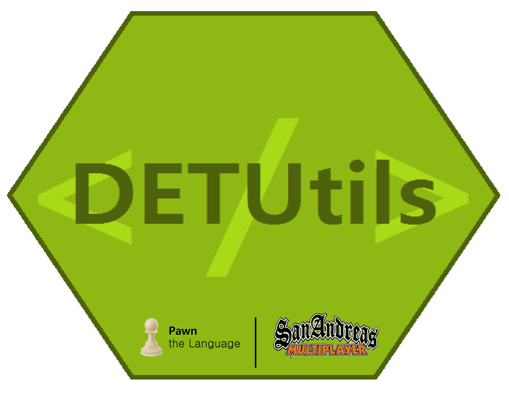

<p align="center">
  
</p>
<h2 align = "center">Welcome to the <b>DETUtils</b> Wiki</h2>
<h4 align = "center">
  Addition to the Pawn language features, open.mp API and Discord Connector plugin.
</h4>

### Current library version: `2.0.5-R2`

Hello scripter! Welcome to *DEntisT's Utilities* (or **DETUtils** for short) "read me" file. So, now, you may ask about - what's this? Well - in general, this addition to open.mp Standard Scripting package contains libraries that have in-game visible effects and libraries that contain new scripting features. 
- Below, you can find information about each library.
- For better understanding of this, make sure you know Pawn and a_samp - read all the docs [here](https://team.sa-mp.com/wiki-archive.html)...

## Examples
Honestly, this packet of libraries exists for show-off reasons, I made it for my own satisfication since I have a really big desire to code, so. You can still contribute and use it though. Example:
- [View code](https://github.com/DEntis-T/SA-MP-DETUtils/blob/2.x/DETUTILS/d_testing/d_testing_entry.inc)
--------------------------------------
## Installation
- Installation is simple, quick and easy - learn more [here](docs/d_installation.md)...
## Documentation
Below is a list of all the libraries provided by the DETUtils pack. They're all optional unless they're used internally, in that case you'll get a warning.

- Entry point from which everything is included - [detutils.inc](docs/detutils.md)

### Pawn Libraries
Libraries whose contain the new language features.

- Rewrite of `y_va` and Pawn `sscanf` implementation - [d_fmargs.inc](docs/d_fmargs.md)
- Completely new variable system - [d_vars.inc](docs/d_vars.md)
- New ALS hooking system - [d_als.inc](docs/d_als.md)
- New `foreach` implementation - [d_foreach.inc](docs/d_foreach.md)
- Excel-like management system - [d_tables.inc](docs/d_tables.md)
- Profile chunks of code - [d_profile.inc](docs/d_profile.md)
- Automatic and manual timers - [d_timers.inc](docs/d_timers.md)
- New callback system - [d_events.inc](docs/d_events.md)

### SA:MP Libraries
Libraries whose contain the new open.mp functions and features.

- Edit player SA:MP server permissions - [d_permissions.inc](docs/d_permissions.md) 
- Command processor with a big amount of features - [d_commands.inc](docs/d_commands.md)
- Create property entrances, with own and custom interiors - [d_properties.inc](docs/d_properties.md)
- Generally smaller groups of random features - [d_visual.inc](docs/d_visual.md)
- Send file queries, save and load cache during runtime - [d_filequeries.inc](docs/d_filequeries.md)
- Anti cheat system - [d_anticheat.inc](docs/d_anticheat.md)
- In-game map editor - [d_mapeditor.inc](docs/d_mapeditor.md)
- Create deathmatch zones - [d_dmzone.inc](docs/d_dmzone.md)
- Better teams, provides new functions - [d_teams.inc](docs/d_teams.md)
- Better dialogs, faster and easier - [d_dialog.inc](docs/d_dialog.md)

### Discord API Libraries
Libraries whose contain the new functions for Discord bot development - these are extensions to Discord Connector plugin and they require the plugin to work.

- Discord slash commands processor - [d_discordcmd.inc](docs/d_discordcmd.md)
- Assign, save and load Discord guild, channel, application and user data - [d_discorddata.inc](docs/d_discorddata.md)

--------------------------------------

Documentation contains some extra notes and tips.

- Read more here: [Extra stuff](docs/d_extra.md)
- Learn more about internal libraries [here](docs/d_internal.md)...
## Tests
- I regularly make test scripts with all new features I added to the library to ensure everything is working as expected. If not, I write it down in to a test log.

Check out test script here:

- [Go to tests...](docs/d_testscript.md)

- You can also run **DETUtils** test script directly from your includes, just use the definition below before including the libraries.
```pawn
#define DETUTILS_TESTING_MODE
```
> As I mentioned, `DETUTILS_TESTING_MODE` flag will enable the test script automatically.
## Filterscripts
- If you're making a filterscript using the *DETUtils* includes, make sure to enable the `DETUTILS_FILTERSCRIPT_MODE` flag.

```pawn
#define DETUTILS_FILTERSCRIPT_MODE
```

- It'll also work if you just simply do:

```pawn
#define FILTERSCRIPT
```

## Limits

- Everything has its limits, so does DETUtils - view them [here](docs/d_limits.md)...

## Beta testing

- Beta testing program is currently down since this project is far away from being done. Also, according to news - new **open.mp** is coming soon, so these libraries shall be updated regularly to keep up with the project.

## Test log

- Recently, I started test logging program in which I log every library issue I spotted during testing. You can check it [here](docs/d_testlog.md)...

## More languages

- English isn't the only language on the planet though, that's why I started language contribution program. I started it by making another library's core include called **d_text.inc** in which are all strings located. Your job as a language contributor is to simply translate it!

Check the file [here...](DETUTILS/d_extra/d_text.inc)

## Troubleshooting

If you're facing problems like function failed to call, function is not valid, critical errors - make sure you enable automatic debugging.
- Automatic debugging literally sends debug messages whenever it needs to.
- With this feature you can easily track problems and report them on Discord or try to troubleshoot them yourself.

To enable advanced debugging feature, use:

```pawn
#define DETUTILS_DEBUG_MODE
```

To join Discord server, [click this link!](https://discord.gg/samp)

**NOTE:** After you enabled advanced debugging, your console may be full with *DETUtils* debug messages - in that case, don't worry.

## Compile-time issues

If you're facing issues with your code compilation after including the library, make sure you have updated Pawn Compiler and SA:MP Standard library package and libraries. Using them outdated can indeed cause issues while trying to implement newer libraries to your code.

- You can get the latest version of SA:MP standard libraries [here](https://github.com/pawn-lang/samp-stdlib)...

- You can get the latest version of Pawn standard libraries [here](https://github.com/pawn-lang/pawn-stdlib)...

- You can get the latest version of Pawn Compiler for SA:MP [here](https://github.com/pawn-lang/compiler/releases)...

## SA:MP DEntisT's Utilities

### Legal:

- Version: MPL 1.1
    
    The contents of files provided in DETUtils are subject to the Mozilla Public License 
    Version 1.1 the "License"; you may not use this file except in compliance with 
    the License. You may obtain a copy of the License at 
    http://www.mozilla.org/MPL/
    
    Software distributed under the License is distributed on an "as is" basis,
    without warranty of any kind, either express or implied. See the License
    for the specific language governing rights and limitations under the
    License.
    
    The Original Code is **SA:MP | DETUtils**.
    
    The Initial Developer of the original code is **DEntisT**.
    Portions created by the Initial Developer are Copyright C 2021
    the Initial Developer. All Rights Reserved.

### Other contributors:

- No one yet.

### Thanks to these people for:

- aezzakmi (no GitHub account) - really productive testing
- [Y_Less](https://github.com/y-less) & Zeex - fmargs ``#emit`` stuff, d_commands decorator concept
- [Zeex](https://github.com/zeex) - ZCMD command processor concept
- Y_Less - code parser, another amazing thing which you can get [here](https://github.com/y-less/code-parse.inc)
- Kirima - command guesser, another cool thing you can get [here](https://github.com/se8870/samp-command-guess)
- Zeex - AMX assembly

### Contributions

- Just fork the repository, apply your wanted changes and create a pull request!

# © & ® BRACE™
