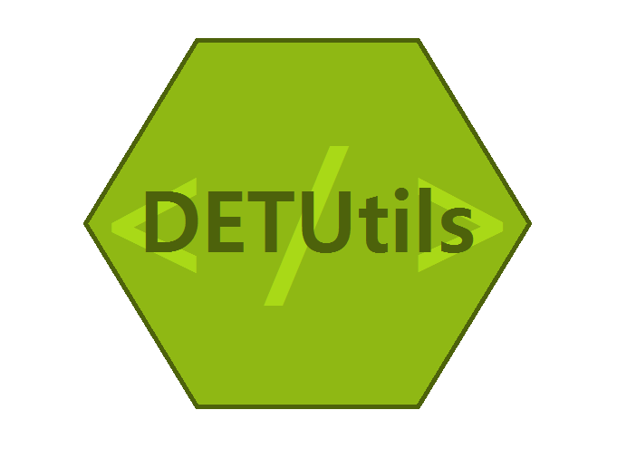

<h1 align = "center">
  <bold>
  SA:MP DET-Utils | Wiki
  </bold>
</h1>
<p align="center">
  
</p>
<h5 align = "center">
  Addition to SA:MP Standard Scripting Library with new stuff, anti-cheat system, map editor and many more functions!
</h5>
<h2 align = "center">
  Functions, callbacks, tips and notes
</h2>

## Current library version: `2.0.2`

Hello scripter! Welcome to *SA:MP DEntisT's Utilities* (or **detutils** for short) "read me" file. So, now, you may ask about - what's this? Well - in general, this addition to SA:MP Standard Scripting package contains libraries that have in-game visible effects and libraries that contain new scripting features. 
- Below, you can find information about each library.
- For better understanding of this, make sure you know Pawn and a_samp - read all the docs [here](https://team.sa-mp.com/wiki-archive.html)...

## Examples

- [View](d_example.md) one simple example of script made using **SA:MP-DET Utilities**.

## Warnings
1. Always include **DETUtils** last, after all includes.
2. You'll need to use latest Pawn Community compiler in order to compile everything successfully.
## Docs
Click on blue text to see all information about each feature.
### Installation
------------------------------------------
- Learn more about [installation](d_installation.md)...
### Libraries
------------------------------------------
- Learn more about d_samp [here](d_samp.md)...
------------------------------------------
- Learn more: [d_commands.inc](d_commands.md)
- Learn more: [d_properties.inc](d_properties.md)
- Learn more: [d_fmargs.inc](d_fmargs.md)
- Learn more: [d_visual.inc](d_visual.md)
- Learn more: [d_anticheat.inc](d_anticheat.md)
- Learn more: [d_mapeditor.inc](d_mapeditor.md)
- Learn more: [d_filequeries.inc](d_filequeries.md)
### Extra bonus
------------------------------------------
- Read more here: [Extra stuff](d_extra.md)
## Tests
- I regularly make test scripts with all new features I added to the library to ensure everything is working as expected.

Check out test script here:

- [Go to tests...](d_testscript.md)

## Limits

- Everything has its limits, so does DETUtils - view them [here](d_limits.md)...

## Beta testing

- Beta testing program is currently down since this project is far away from being done. Also, according to news - new **open.mp** is coming soon, so these libraries shall be updated regularly to keep up with the project.

## Test log

- Recently, I started test logging program in which I log every library issue I spotted during testing. You can check it [here](d_testlog.md)...

## More languages

- English isn't the only language on the planet though, that's why I started language contribution program. I started it by making another library's core include called **d_text.inc** in which are all strings located. Your job as a language contributor is to simply translate it!

Check the file [here...](DETUTILS/d_extra/d_text.inc)

## Troubleshooting

If you're facing problems like function failed to call, function is not valid, critical errors - make sure you enable automatic debugging.
- Automatic debugging literally sends debug messages whenever it needs to.
- With this feature you can easily track problems and report them on Discord or try to troubleshoot them yourself.

To enable advanced debugging feature, use:

```pawn
#define DETUTILS_DEBUG_MODE
```

To join Discord server, [click here...](https://discord.gg/samp)

**NOTE:** After you enabled advanced debugging, your console may be full with *DETUtils* debug messages - in that case, don't worry.

## Compile-time issues

If you're facing issues with your code compilation after including the library, make sure you have updated Pawn Compiler and SA:MP Standard library package and libraries. Using them outdated can indeed cause issues while trying to implement newer libraries to your code.

- You can get the latest version of SA:MP standard libraries [here](https://github.com/pawn-lang/samp-stdlib)...

- You can get the latest version of Pawn standard libraries [here](https://github.com/pawn-lang/pawn-stdlib)...

- You can get the latest version of Pawn Compiler for SA:MP [here](https://github.com/pawn-lang/compiler/releases)...

### Thanks

- Big thanks to *open.mp* community for helping me during library development.

## SA:MP DEntisT's Utilities

### Legal:

- Version: MPL 1.1
    
    The contents of files provided in DETUtils are subject to the Mozilla Public License 
    Version 1.1 the "License"; you may not use this file except in compliance with 
    the License. You may obtain a copy of the License at 
    http://www.mozilla.org/MPL/
    
    Software distributed under the License is distributed on an "as is" basis,
    without warranty of any kind, either express or implied. See the License
    for the specific language governing rights and limitations under the
    License.
    
    The Original Code is **SA:MP | DETUtils**.
    
    The Initial Developer of the original code is **DEntisT**.
    Portions created by the Initial Developer are Copyright C 2021
    the Initial Developer. All Rights Reserved.

### Other contributors:

- Unity

### Thanks to these people for:

- aezzakmi (no GitHub account) - help during development
- [Unity](https://github.com/kyekalcor) - testing and really minor fixes
- [Y_Less](https://github.com/y-less) & Zeex - fmargs ``#emit`` stuff, d_commands decorator concept
- [Zeex](https://github.com/zeex) - ZCMD command processor concept
- Y_Less - code parser, another amazing thing which you can get [here](https://github.com/y-less/code-parse.inc)

### Contributions

- Just fork the repo, apply your changes and create a pull request!
