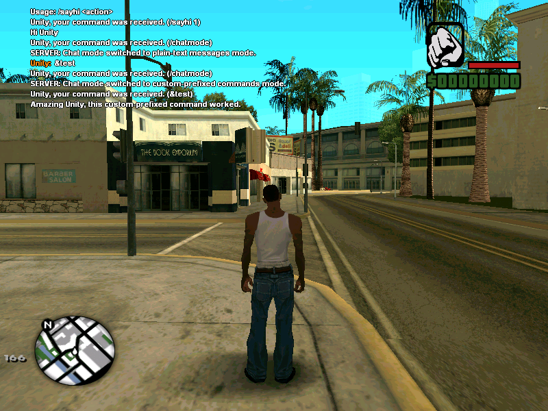

# d_commands.inc
SA:MP Commands - a "built-in" fast and easy way to create commands.



[Go back to home page...](README.md)

## How to start to use?

### Command declaration
------------------------------------------
To declare a command, you need to use ``@command`` decorator. This way of command declaration is MAINLY supported and regularly updated.

Let's see how it works:

```pawn

@command(.type = SLASH_COMMAND) mycommand(playerid, params[]) 
{
    SendClientMessage(playerid, -1, "Your very first command works!");
    return 1;
}

```

... and - that's it, command is declared, and whenever someone sends */mycommand* to chat, a message saying "Your very first command works!" appears.

#### Why is it done this way?

- Using ``command`` keyword, as I used 6 months ago also started to look absurd to me, since keywords are components of syntax of a certain programming language, so creating ``command`` keyword for visual feature makes no sense to me. And since, I looked at commands as visual entities, such as TextDraws and 3D Labels, whose have their tags, so I decided to make that - ``new Command:.``!

But, that also wasn't a great idea - tags are already a language feature, denoting return "types".  Using them for a totally different purpose, but looking the same, is confusing and misleading. Keywords are for language features, things like commands and vehicles are API, not language. But then, declaring commands should be easy, so we need a third thing that is neither keywords nor tags - and I have actually proposed something in this vein before, because is something that has been solved in other languages - decorators.

So instead of:
```c
new Command:help()
{
}
```
Or:
```c
command help()
{
}
```
You have:
```c
@command() help()
{
}
```
I know it is a subtle difference, but an important one.

#### Macros

- These macros are not that much complex but anyways are a nightmare - they are set up in ``d_commands_setup``. The rest is in ``d_commands_macros``. Note that they won't be FULLY reduced to normal Pawn syntax by the preprocessor (I am talking about ``-l`` compile option).

### Bonus
-----------------------------------------

- More command declaration styles for backwards compatibility...
- Let's take a look:

```pawn
DETUTILS Command:cmd(playerid,params[]) // Compatibility mode, use `#define DETUTILS_COMPAT`.
{
    // Code.
    return 1;
}

command mycommand(playerid, params[])
{
  SendClientMessage(playerid, -1, "{ffffff}Your very first command works!");
  return 1;
}

COMMAND:cmd(playerid, params[])
{
	// Code.
	return 1;
}

Command:cmd(playerid,params[])
{
    // Code.
    return 1;
}

CMD:cmd(playerid, params[])
{
	// Code.
	return 1;
}

YCMD:cmd(playerid, params[])
{
	// Code.
	return 1;
}

cmd:cmd(playerid, params[])
{
	// Code.
	return 1;
}
```

### Command aliasing
------------------------------------------
There is also way to declare alias of a specific command.

```pawn
@command(.type = ALIAS_COMMAND) cmds( playerid, params[]) = help;
```
... or, if you're outdated, these are still usable.
```pawn

alias command mycmd(playerid, params[]) = mycommand;

// ... or:

CommandAlias:mycmd(playerid, params[]) = mycommand;

// ... or if the `DETUTILS_COMPAT` is on:

DETUTILS CommandAlias:mycmd(playerid, params[]) = mycommand;

```

### Command debugging
------------------------------------------
There is also a way to debug commands!

Advanced debugging can be done using ``OnCommandStateChange`` and ``OnPrefixedCommandStateChange`` - depends on command type.

Example:

```pawn
public OnCommandStateChange(playerid, cmdtext[], stateid)
{
	printf("Command state changed. Command: %s", cmdtext[]);
	return 1;
}

// ... or:

public OnPrefixedCommandStateChange(playerid, cmdtext[], stateid)
{
	printf("Custom prefixed command state changed. Command: %s", cmdtext[]);
	return 1;
}
```
### Debug states
------------------------------------------
- For advanced debugging, one ``print`` isn't enough - right? That is why I added command debug states. Command debug is called 3 times after player submits to execute a command, so there are three debug states.

- Debug states:

- ``COMMAND_DEBUG_STATE_INVALID`` - invalid debug state, really hard to 'achieve' though
- ``COMMAND_DEBUG_STATE_RECEIVED`` - command processor received command and command parameters
- ``COMMAND_DEBUG_STATE_READY`` - command is ready to be performed
- ``COMMAND_DEBUG_STATE_PERFORMED`` - command performed successfully
- ``COMMAND_DEBUG_STATE_STOPPED`` - explanation shown some scrolls below

**How to use states?**
------------------------------------------
- To use states, you need to use **publics shown above**. Here's how to do it:

```pawn
public OnCommandStateChange(playerid, cmdtext[], stateid) 
{
    if(stateid == COMMAND_DEBUG_STATE_RECEIVED)
    {
        printf("Command %s received.", cmdtext);
        return 1;
    }
    else if(stateid == COMMAND_DEBUG_STATE_READY)
    {
        printf("Command %s ready.", cmdtext);
        return 1;
    }
    else if(stateid == COMMAND_DEBUG_STATE_PERFORMED)
    {
        printf("Command %s performed.", cmdtext);
        return 1;
    }
    return 1;
}

// ... or:

public OnPrefixedCommandStateChange(playerid, cmdtext[], stateid) 
{
    if(stateid == COMMAND_DEBUG_STATE_RECEIVED)
    {
        printf("Custom prefixed command %s received.", cmdtext);
        return 1;
    }
    else if(stateid == COMMAND_DEBUG_STATE_READY)
    {
        printf("Custom prefixed command %s ready.", cmdtext);
        return 1;
    }
    else if(stateid == COMMAND_DEBUG_STATE_PERFORMED)
    {
        printf("Custom prefixed command %s performed.", cmdtext);
        return 1;
    }
    return 1;
}
```

### Admin commands
------------------------------------------
*d_commands* also lets you to create admin commands.

```pawn
@command(.type = ADMIN_COMMAND) admincheck(playerid, params[]) 
{
    SendClientMessage(playerid, -1, "Yes you are.");
    return 1;
}
```

... for outdated poeple:
You can do it easily and fast mixing ``admin`` and ``command`` keywords.

Example:

```pawn
admin command admincheck(playerid,params[])
{
  SendClientMessage(playerid, -1, "You're admin.");
  return 1;
}

// ... or:

AdminCommand:admincheck(playerid,params[])
{
  SendClientMessage(playerid, -1, "You're admin.");
  return 1;
}

// Compat mode:

DETUTILS AdminCommand:admincheck(playerid,params[])
{
  SendClientMessage(playerid, -1, "You're admin.");
  return 1;
}
```

**INFO**: If player is not logged in as RCON administrator, function will return *false* (0) and send client message saying: **"SERVER: Unknown command."**

### Commands with custom prefix
------------------------------------------
*d_commands* also arrive with brand new system with custom-prefixed commands.

```pawn
@command(.type = PREFIXED_COMMAND, .prefix = "!") mycmd( playerid, params[] ) 
{
    SendClientMessage(playerid, -1, "This worked, %s.", ReturnPlayerName(playerid));
    return 1;
}
```

... for outdated people:

Create commands like those using two keywords and one extra parameter - fast and easy. You can also use ``decl`` keyword.

- Let's see how to do it:

```pawn
prefixed command mycmd(Prefix:"!", playerid, params[])
{
  SendClientMessage(playerid, -1, "This worked, %s.", ReturnPlayerName(playerid));
  return 1;
}

// ... or:

PrefixedCommand:mycmd(Prefix:"!", playerid, params[])
{
  SendClientMessage(playerid, -1, "This worked, %s.", ReturnPlayerName(playerid));
  return 1;
}

DETUTILS PrefixedCommand:mycmd(Prefix:"!", playerid, params[])
{
  SendClientMessage(playerid, -1, "This worked, %s.", ReturnPlayerName(playerid));
  return 1;
}
```

Now, whenever player sends ``!mycmd`` to chat, command will be executed (performed).

**INFO**: To use custom-prefixed commands, you also need to use new built-in **/chatmode** command. This built-in command toggles the ability of a player to execute these commands.

**WARNING:** Command's prefix can only contain 1 character!

#### Creating prefixes as variables

Simple code:

```pawn
@prefix(.value = "!") prefix(); // Use prefix decorator to make prefix named `prefix`

@command(.type = PREFIXED_COMMAND, .prefix = prefix) prefixtest(playerid, params[]) // Make custom prefixed command with `prefix` commands 
{
    SendClientMessage(playerid, -1, "Cool prefix test.");
    return 1;
}
```

... or for outdated ones:

- That's also possible. Just use ``decl`` keyword and ``Prefix:`` tag in order to do that.

```pawn
Prefix:qmark = "?"; // Create a prefix called 'qmark', stands for 'Question Mark'.

// ... or:

DETUTILS Prefix:qmark = "?"; // Create a prefix called 'qmark', stands for 'Question Mark'.
```
- Now, instead of providing a prefix string directly - just provide prefix's name:

```pawn
PrefixedCommand:discord(Prefix:qmark, playerid, params[])
{
  SendClientMessage(playerid, -1, "Hi, %s - join discord.gg/samp", ReturnPlayerName(playerid));
  return 1;
}
PrefixedCommand:mycmd(Prefix:qmark, playerid, params[])
{
  SendClientMessage(playerid, -1, "This worked, %s.", ReturnPlayerName(playerid));
  return 1;
}
PrefixedCommand:forum(Prefix:qmark, playerid, params[])
{
  SendClientMessage(playerid, -1, "%s, check open.mp/discussion", ReturnPlayerName(playerid));
  return 1;
}
```

**INFO:** Not using the prefix in a command won't cause symbol-unused warning.

#### What's so-called chat mode thing?

- It's, simply said, variable which controls the function of normal SA-MP chat. There are two chat modes, **CHAT_MODE_PLAIN_TEXT_MESSAGES (with ID 0)** and **CHAT_MODE_PREFIXED_COMMANDS (with ID 1)**. Player can execute custom prefixed commands only if their chat mode is **CHAT_MODE_PREFIXED_COMMANDS**. Players can switch their chat mode using mentioned **/chatmode** command.

- You can also use these two functions in order to manage player's chat mode.

**GetPlayerChatMode**

- Used to get information about which chat mode certain player is using.

```pawn
new chatmode = GetPlayerChatMode(playerid);
```

**SetPlayerChatMode**

- Uset to set chat mode for certain player.

```pawn
if(chatmode == CHAT_MODE_PLAIN_TEXT_MESSAGES)
{
	SetPlayerChatMode(playerid, CHAT_MODE_PREFIXED_COMMANDS);
	SendClientMessage(playerid, -1, "Now you can use custom-prefixed commands.");
}

```
### OnPlayerPassCommandPrefix

- ``d_commands``'s custom-prefixed commands system also contains ``OnPlayerPassCommandPrefix`` callback which is always called before ``COMMAND_DEBUG_STATE_READY``. Really useful callback for logging and preventing the usage of commands with certain prefix. If ``OnPlayerPassCommandPrefix`` returns ``0``, ``OnPrefixedCommandStateChange`` will be called with debug state ``COMMAND_DEBUG_STATE_STOPPED``.

Example:
```pwn

// Declare SomeCoolPrefix somewhere in your code...

public OnPlayerPassCommandPrefix(playerid, cmdtext[], passedprefix[], expectedprefix[])
{
    SendClientMessage(playerid, -1, "CMD: %s | Passed prefix: %s | Expected command prefix: %s", cmdtext, passedprefix, expectedprefix);
    // For logging purposes.
    // Parameter explanation:
    
    // playerid - id of a player
    // cmdtext[] - full command text, with prefix and command name (example: "&test")
    // passedprefix[] - prefix player passed (example: "$")
    // expectedprefix[] - prefix expected by the command processor (in this case: "&")
    
    // Let's see what we have done here:

	// Checked if passed and expected command prefixes match in order to check is command a valid command (aka exists).
	// Then &&, if passedprefix is equal to prefix we declared! 
    if(passedprefix[0] == expectedprefix[0] && passedprefix[0] == SomeCoolPrefix[0])
    {
    	// If check succeded...
        SendClientMessage(playerid, -1, "You aren't allowed to use commands with & prefix!"); // Send player a message...
        return 0; //  Return 0 to prevent command processor with processing the command.
    }
    return 1; // Or... just return 1 if player used another command, like "@help".
}

```
- How to see if command processing for certain command has stopped because of the check above? Check code below:
```pawn
public OnPrefixedCommandStateChange(playerid, cmdtext[], stateid)
{ 
	if(stateid == COMMAND_DEBUG_STATE_STOPPED)
	{
		printf("Command processing for command %s stopped.", cmdtext);
	}
	return 1;
}
```

### Commands with custom permissions
------------------------------------------

### OUTDATED!

*d_commands* also allows you to create commands that require certain permissions / conditions to be executed. This is really nice feature if you're making administrator system, V.I.P. system or anything else that has to do with the user system.

- Let's see how to create **roles**. To create role you need to use ``create role`` keywords.

- Let's declare some variables:

```pawn
enum Enums
{
  Money,
  Bank,
  Deaths,
  Kills,
  Admin
}

new Player[MAX_PLAYERS][Enums];
```

- Now, let's create a role.

```pawn
create role AdminRole(playerid, Player[playerid][Admin] == 1);

// ... or:

Role:AdminRole(playerid, Player[playerid][Admin] == 1);

DETUTILS Role:AdminRole(playerid, Player[playerid][Admin] == 1);
```

- Now, we have our role - let's use it in our command.
- To create role commands, you need to use ``role command`` keywords.

```pawn
role command clearchat(Role:AdminRole, playerid, params[])
{
	for(new i; i < 20; i++)
		SendClientMessage(playerid, -1, "");

	SendClientMessage(playerid, -1, "You cleared the chat.");
	return 1;
}

// ... or:

RoleCommand:clearchat(Role:AdminRole, playerid, params[])
{
	for(new i; i < 20; i++)
		SendClientMessage(playerid, -1, "");

	SendClientMessage(playerid, -1, "You cleared the chat.");
	return 1;
}

DETUTILS RoleCommand:clearchat(Role:AdminRole, playerid, params[])
{
	for(new i; i < 20; i++)
		SendClientMessage(playerid, -1, "");

	SendClientMessage(playerid, -1, "You cleared the chat.");
	return 1;
}
```

Now, we created a command which requires ``AdminRole`` role to be executed - performed.

**NOTE**: If role command's conditions are not met, command will return ``0`` (false) and will send client message saying: **"SERVER: Unknown command."**

### UPDATED!

Roles are now **command flags**. Despite the fact that code syntax above is still supported, it's still marked as outdated since I am not updating those methods anymore, this is the new updated decorator command type. Note that the other documentation (without the code examples and new - old in this case - keywords) for this feature is still valid.

How you SHOULD do it from now on:

```pawn
@flag(.dependencies = (Player[playerid][Admin] == 1)) AdminRole(playerid);

@command(.type = FLAGGED_COMMAND, .flag = AdminRole) clearchat(playerid,params[]) 
{
    	for(new i; i < 20; i++)
		SendClientMessage(playerid, -1, "");

	SendClientMessage(playerid, -1, "You cleared the chat.");
	return 1;
}
```

## API ( programming interface )

- *d_commands.inc* also contains some handy functions, let's see.

### CallCommand

- Function ``CallCommand``, obviously, is used to call a command.
- Let's see a small example:

```pawn
CallCommand("sayhi", playerid, params); 
```
- So, very simple, this will call a normal **local** command (counts for role commands, admin commants etc).

But, as I mentioned, code above will call a local command, that is why I added **command call type** parameter. Read more below!

### Command call types

#### ``COMMAND_TYPE_LOCAL``

- This is the default call type.

This code:
```pawn
CallCommand("sayhi", playerid, params); 
```
... is same as this one:
```pawn
CallCommand("sayhi", playerid, params, COMMAND_TYPE_LOCAL); 
```
#### ``COMMAND_TYPE_REMOTE``

- This calls the remote commands (commands in all loaded scripts).

```pawn
CallCommand("sayhi", playerid, params, COMMAND_TYPE_REMOTE); 
```

#### ``COMMAND_TYPE_LOCAL_PREFIXED``

- Slash commands and custom-prefixed commands are totally 'different worlds' - that's why this one exists.

```pawn
CallCommand("sayhi", playerid, params, COMMAND_TYPE_LOCAL_PREFIXED); 
```

#### ``COMMAND_TYPE_REMOTE_PREFIXED``

- Like one above, but for remote prefixed commands, also note that you don't put the prefix in command name parameter.

```pawn
CallCommand("sayhi", playerid, params, COMMAND_TYPE_REMOTE_PREFIXED); 
```

**Command processing**
------------------------------------------
A simple script:

```pawn
// When player enters prefixed command:
public OnPrefixedCommandReceived(playerid, cmdtext[])
{
    SendClientMessage(playerid, -1, "%s, your command was received. (%s)", ReturnPlayerName(playerid), cmdtext);
    return 1;
}

// When command text goes trough processor
public OnPrefixedCommandPerformed(playerid, cmdtext[], success)
{
	// If command doesn't exist:
    if(!success)
    {
        SendClientMessage(playerid, -1, "Command %s doesn't exist.", cmdtext);
    }
    // Else just return 1.
    return 1;
}

// When player submits a regular command:
public OnPlayerCommandReceived(playerid, cmdtext[])
{
    SendClientMessage(playerid, -1, "%s, your command was received. (%s)", ReturnPlayerName(playerid), cmdtext);
    return 1;
}

// When command goes trough processor:
public OnPlayerCommandPerformed(playerid, cmdtext[], success)
{
	// If command does not exist:
    if(!success)
    {
        SendClientMessage(playerid, -1, "Command %s doesn't exist.", cmdtext);
    }
    // else return 1
    return 1;
}
```

## Messages from creator
------------------------------------------
### Warnings
------------------------------------------
1. Make sure that whenever you create commands using the ``command`` keyword, the command name does not contain capital letters. Otherwise, unfortunately - server will recognize the command as unknown. But - this does not need to make you sad because this type of commands are not case-sensitive.
2. Custom-prefixed commands are case-sensitive. Also, command names can contain capital letters.
3. ``params[]`` custom-prefixed command parameter won't work with *sscanf*. The parameter is here to follow normal command standards and can be used like a *local* string variable.

### Notes
------------------------------------------
***Backwards compatibility***
- d_commands also have backwards compatibility, incase you are upgrading from iZCMD/ZCMD, the ``CMD:`` keyword will still work as nothing changed. But, I still recommend creating your future commands using methods shown in tutorials and examples above.
- Also, ``YCMD:`` and ``COMMAND:`` keywords will work.
------------------------------------------
***Making filterscript with d_commands?***

- Well, I have good news for you, because there is also new filterscript support feature. 

- So, if you're making a filterscript - make sure you use:

```pawn
#define FILTERSCRIPT
```
... before including *d_commands*.
