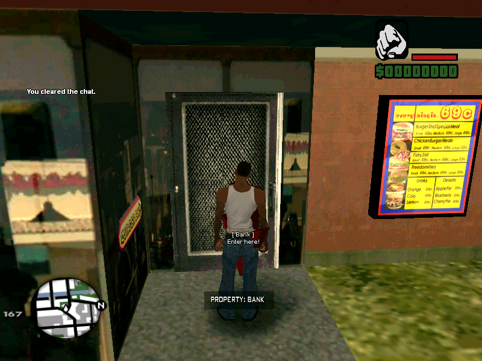

# d_properties.inc
SA:MP Properties - an easy way to create custom properties.



[Go back to home page...](README.md)

## How to start to use?

### Property creation
------------------------------------------
To create a property with *d_properties*, make sure you use *CreatePropertyEntrance* function.

Let's see how it works:

```pawn

public OnGameModeInit()
{
  CreatePropertyEntrance("24/7 Market", 811.1299,-1616.0647,13.5469, 0, 0, true, INTERIOR_MARKET_247_1); // Create entrance for 24/7 Market.
  return 1;
}

```

... and - that's it, property entrance is created on coordinates *243.66,345.21,12.78*, and property exit, virtual world and interior id are set automatically depending on interior you set - in this case, it's **INTERIOR_MARKET_247_1**. And whenever player press key which he use to enter a vehicle (in most cases it's F key) near entrance coordinates given, he will be *teleported* on coordinates of property's exit.

- Though, most people prefer mapping their own interiors, so - in order to support that, I added extra parameters to **CreatePropertyEntrance** function.

... so:

```pawn
public OnGameModeInit()
{
  CreatePropertyEntrance("Your Property", 811.1299,-1616.0647,13.5469, 0, 0, true, INTERIOR_CUSTOM, 0.0000, 0.0000, 4.0000, 1, 1);
  // In order to make YOUR CUSTOM property with custom interior you mapped, you need to provide extra data (parameters).
  // So, you need to change interior type to INTERIOR_CUSTOM and add exit coordinates, and interiorid and virtual world.
  return 1;
}
```

... all parameters:

```pawn
native CreatePropertyEntrance(const name[], Float:x1, Float:y1, Float:z1, interiorid, worldid, bool:labels = false, interior = INTERIOR_CUSTOM, Float:x2 = 0.000, Float:y2 = 0.000, Float:z2 = 0.000, interiorid2 = 0, worldid2 = 0);
```

#### Properties

- This include also provides default interiors (as I mentioned), if you provide it as a last parameter - exit coordinates, interior ID and virtual world ID will be automatically assigned to property data, as I did here: ``CreatePropertyEntrance("24/7 Market", 811.1299,-1616.0647,13.5469, 0, 0, true, INTERIOR_MARKET_247_1); // Create entrance for 24/7 Market.``, below you can see all interiors you can use - including their look and ``INTERIOR_(...)`` ID.

**Coming soon...**

**WARNING**: Make sure to provide valid ``INTERIOR_(...)`` ID when creating a property.

### Property debugging
------------------------------------------
- Whenever *CreateCustomInterior* is called, it automatically sends debug messages in the console.

### Property callbacks
------------------------------------------
#### ``public`` OnPropertyCreated

- Called whenever is custom interior created. Example:
```pawn
public OnPropertyCreated(propertyid)
{
    printf("Property created! ID: %i", propertyid);
    return 1;
}
```
#### ``public`` OnPropertyActionPerformed

- It's called whenever player enters or exits a **certain** property. In order to use the callback, you need to specify property's name and player's ID. Little example is shown below.

```pawn
public OnPropertyActionPerformed(playerid, propertyid, actionid)
{
    new string[256];
    if(actionid == PROPERTY_ACTION_ENTER)
    {
        format(string, 256, "You entered %s, %s. Property id: %i [%i]", 
            
            GetPropertyName(propertyid),
            ReturnPlayerName(playerid), 
            GetPropertyIDByName(g_PropertyData[propertyid][p_PropertyName]), //GetPropertyIDByName(GetPropertyName(propertyid)), // to ensure this also works
            propertyid);
        SendClientMessage(playerid, -1, string);
        return 1;
    }
    else if(actionid == PROPERTY_ACTION_EXIT)
    {
        format(string, 256, "You exited %s, %s. Property id: %i [%i]", 
            
            GetPropertyName(propertyid),
            ReturnPlayerName(playerid), 
            GetPropertyIDByName(GetPropertyName(propertyid)),
            propertyid);
        SendClientMessage(playerid, -1, string);
        return 1;
    }
    else if(actionid == PROPERTY_ACTION_LOCK)
    {
        SendClientMessageToAll(-1, "Property %s [%i] is now locked!", 
            GetPropertyName(propertyid), GetPropertyIDByName(GetPropertyName(propertyid)));
    }
    else if(actionid == PROPERTY_ACTION_UNLOCK)
    {
        SendClientMessageToAll(-1, "Property %s [%i] is now unlocked!", 
            GetPropertyName(propertyid), GetPropertyIDByName(GetPropertyName(propertyid)));
    }
    return 0;
}
```

**TIP:** The reason I used **SendClientMessageToAll** on action IDs **PROPERTY_ACTION_LOCK** and **PROPERTY_ACTION_UNLOCK** is because in these two cases, ``playerid`` is returned as ``INVALID_PLAYER_ID`` since ``TogglePropertyLocked(...)`` doesn't have player ID parameter!

#### ``public`` OnPlayerEnterProperty

- This is called whenever player enters any property. Can be used for big variety stuff. Uses only one parameter - *playerid*.

Example:
```pawn
public OnPlayerEnterProperty(playerid)
{
  new message[256];
  format(message, 256, "%s opens the door and enters the object.", ReturnPlayerName(playerid));
  SendMessageInRange(3.0, playerid, message, -1);
  return 1;
}
```

#### ``public`` OnPlayerExitProperty

- This is called whenever player exits any property.

```pawn
public OnPlayerExitProperty(playerid)
{
  new message[256];
  format(message, 256, "%s opens the door and leaves the place.", ReturnPlayerName(playerid));
  SendMessageInRange(3.0, playerid, message, -1);
  return 1;
}
```

**TIP:** Functions *ReturnPlayerName* and *SendMessageInRange* are extra library functions. Include DETUtils to use them.

## API ( programming interface )

### Functions

*d_properties.inc* also contains some handy functions, let's see.

#### SetPlayerProperty

- This function sets player's interior. Interior id can be seen after certain interior is created - thanks to debug messages!

**WARNING**: Interior id will be always same unless it is not created on callback *OnGameModeInit* or you changed interior creating algorithm.

Parameters:

  - playerid (integer)
  - propertyid (integer) 

Example:

```pawn
static Your_Function(player, id)
{
  SetPlayerProperty(player, id);
  return 1;
}
```
#### GetLastPropertyIDUsed

- Gets last property id which was used to assign interior data to.

**WARNING**: Works best and properly after using ``CreatePropertyEntrance``, because ``CreatePropertyEntrance`` updates the ID after called.

#### SetPropertyEntranceCustomAngles

- This function sets interior entrance and exit position angles.

Parameters:

  - propertyid (integer)
  - angle_a (float)
  - angle_b (float)

Example:

```pawn
public OnGameModeInit()
{
  CreatePropertyEntrance(...); // your params
  SetPropertyEntranceCustomAngles(GetLastPropertyIDUsed(), 234.453, 0.23);
  return 1;
}
```
#### ClearPlayerPropertyData

- The thing this function does is really simple. Clears property id data which is assigned to player's data.

Parameters:
 
 - playerid (integer)

**NOTE**: This is called usually on callback *OnPlayerDisconnect*.

Example:

```pawn
public OnPlayerDisconnect(playerid, reason)
{
  ClearPlayerPropertyData(playerid);
  return 1;
}
```
#### IsPlayerInProperty

- Also, one simple function - checks if is player in one of properties declared in the script.

- If yes, returns *true*, else returns *false*.

Parameters:

  - playerid (integer)

```pawn
if(IsPlayerInProperty(playerid)) return SendClientMessage(playerid, -1, "You're in a property.");
```

#### GetPropertyName


- Used to get property's name. Usage example shown on **``public`` OnPropertyActionPerformed** documentation.

#### GetPropertyIDByName


- Used to get property's ID by specifying its name. Usage example shown on **``public`` OnPropertyActionPerformed** documentation.

#### IsPropertyLocked

- Used to check if is certain property locked.

```pawn
if(IsPropertyLocked(propertyid)) { SendClientMessage(playerid, -1, "Sorry, %s! This is locked.", ReturnPlayerName(playerid)); }
```

#### TogglePropertyLocked

- Used to "lock property's door", if the property is locked, then anyone inside and outside the property won't be able to enter and exit - efficient in commands.

```pawn
decl Command:lock(playerid, params[])
{
    new propertyid = GetNearPropertyEntrance(playerid);
    if(propertyid == 0) return SendClientMessage(playerid, -1, "You need to be near property entrance.");
    if(IsPropertyLocked(propertyid))
    {
        TogglePropertyLocked(propertyid, false);
        SendClientMessage(playerid, -1, "You Successfully Unlocked: %s", GetPropertyName(propertyid));
        return 1;
    }
    else if(!IsPropertyLocked(propertyid))
    {
        TogglePropertyLocked(propertyid, true);
        SendClientMessage(playerid, -1, "You Successfully Locked: %s", GetPropertyName(propertyid));
        return 1;
    }
    return 1;
}
```

#### GetNearPropertyEntrance

- Used to get the ID of a property near the player. Example is shown above.

## Messages from creator

### Warnings
------------------------------------------
- No warnings - yet.

### Notes
------------------------------------------

***Making filterscript with d_properties?***

- Well, I have good news for you, because there is also new filterscript support feature. 

- So, if you're making a filterscript - make sure you use:

```pawn
#define FILTERSCRIPT
```
... before including *d_properties*.
